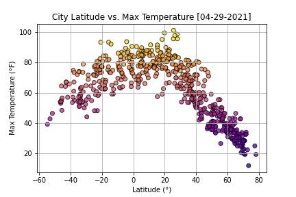
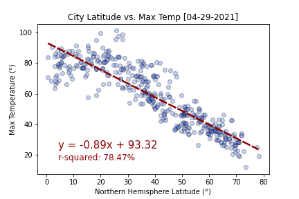

# Python-API-challenge
### Data Analysis & Visualization of weather variables & geographic coordinates

#### Description
The scope of this analisys is to look for a relationship between latitude and diverse weather markers (max temperature, humidity, cloudiness and wind speed). Latitude is considered the independent variable and weather markers as dependant (to latitude) variables. Scatter plots and linear regressions are used to visually and numerically discover (respectively) if there is any relationship between the selected variables.

#### Script Summary
This script takes advantage of Jupyter Notebook features to showcase the description of the analysis workflow (Markdown), the programming code (Python), managing datasets (Pandas Dataframes), computing results and be able to display charts & plots (Matplotlib) and visualize Google maps markers & heatmaps (juypyter gmaps).

Python `citypy` is used to get nearest city name from randomly generated geographic coordinates (latitude & longitude) and API calls are performed using Python `requests`.

Data collection is achieved using two main sources:
- **Open Weather API** to retrieve current weather data for any given location (lat, lng).
- **Google Places API (Nearby Search)** to find places (by type) within (radius) a specified area (location).

#### Data Analysis Workflow

##### WeatherPy

1. Generate random geographic coordinate pairs (lat, lng).
2. Get city name for given locations using `citypy`.
3. Collect weather variables from Open Weather API for each city:
   + Max Temperature (°F)
   + Humidity (%)
   + Cloudiness (%)
   + Wind Speed (mph)
4. Export raw weather data to CSV.
5. Inspect and clean data.
6. Visualize data (scatter plot) using latitude as independant variable.
7. Split dataset for northern and southern hemispheres:
  + Run linear regression
  + Compute Pearson correlation coefficient
  + Display linear regression results over scatter plot

##### VacationPy

1. Import raw weather data from CSV.
2. Generate heatmap layer using humidity values of all cities:
   + Add layer to base map.
   + Display map.
3. Set ideal weather conditions.
4. Select cities according to ideal weather criteria.
5. Collect hotel data for ideal cities using Google Places API (nearby search).
6. Get first found hotel data for each ideal city.
7. Generate marker (hotel) layer with pop-up (info) box:
   + Add layer to previous map.
   + Display final map.

#### Data Visualization

| Scatter plot using `cmaps` | Linear regression results `stats.linregress` |
| --- | --- |
|  |  |

| Jupyter `gmaps` weighted heatmap & marker layers |
| --- |
|  |

##### Note
Jupyter Notebooks `WeatherPy.ipynb` &  `VacationPy.ipynb` are not correctly displayed in the GitHub interface. It is strongly suggested to download these files in order to run them natively.
