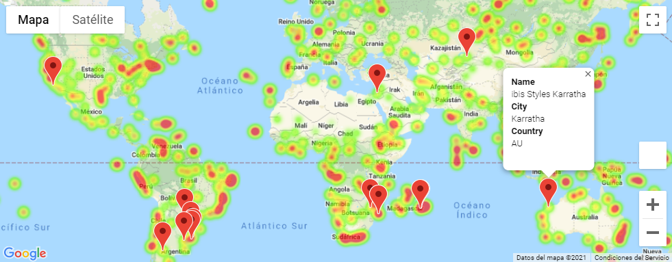

# Python-API-challenge
### Data Analysis & Visualization of weather variables & geographic coordinates

#### Script Summary
This script takes advantage of Jupyter Notebook features to showcase the description of the analysis workflow (Markdown), the programming code (Python), managing datasets (Pandas Dataframes), computing results and be able to display charts & plots (Matplotlib) and visualize Google maps markers & heatmaps (juypyter gmaps).

Python `citypy` is used to get nearest city name from randomly generated geographic coordinates (latitude & longitude) and API calls are performed using Python `requests`.

Data collection is achieved using two main sources:
1. **Open Weather API** to retrieve current weather data for any given location (lat, lng).
2. **Google Places API (Nearby Search)** to find places (by type) within (radius) a specified area (location).

#### Data Analysis Workflow

#### Data Visualization
 

| Scatter plot using `cmaps` | Linear regression results `stats.linregress` |
| --- | --- |
|  |  |

 

| Jupyter `gmaps` weighted heatmap & marker layers |
| :-- |
|  |

